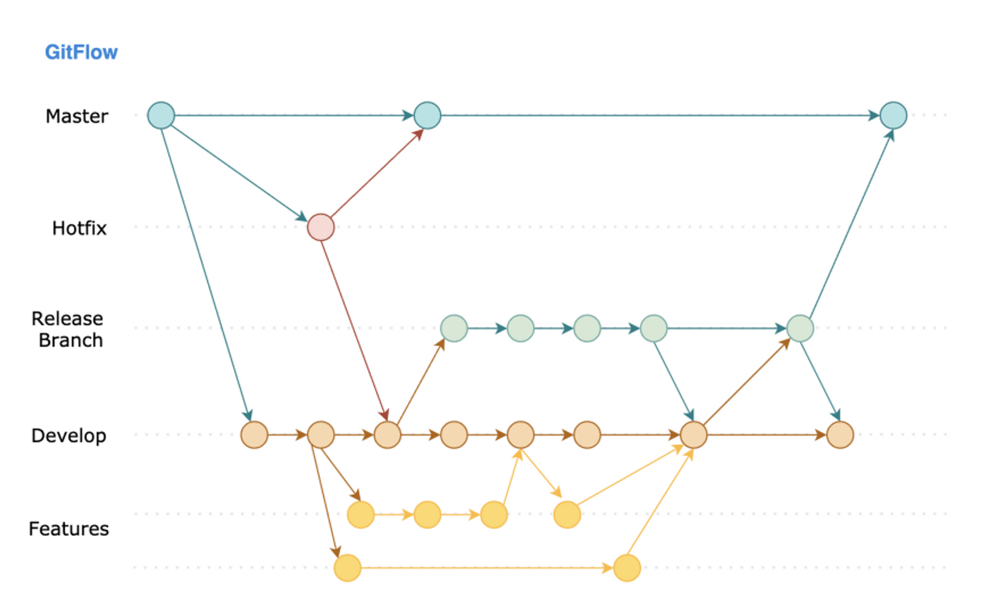
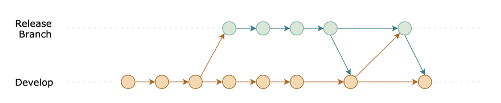
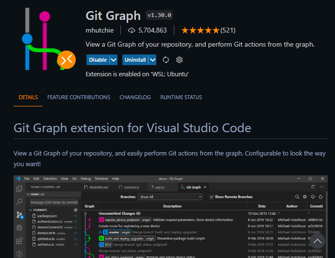
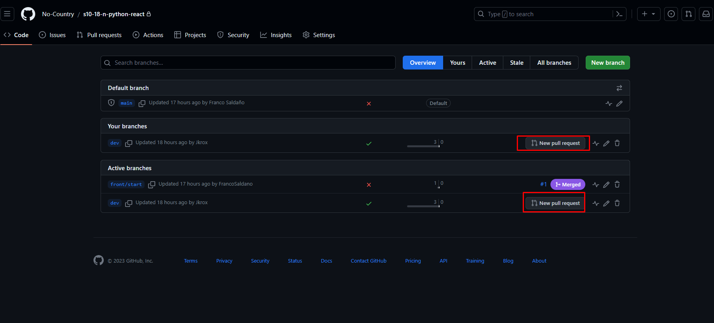
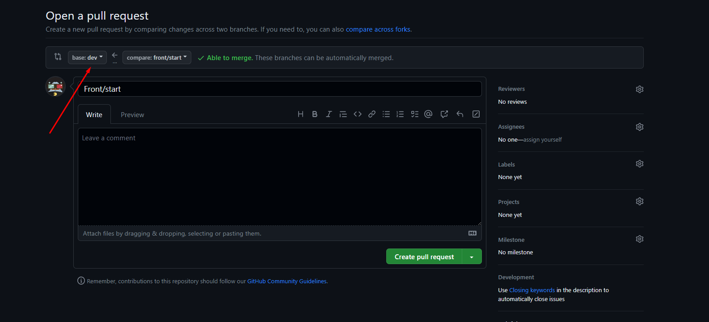
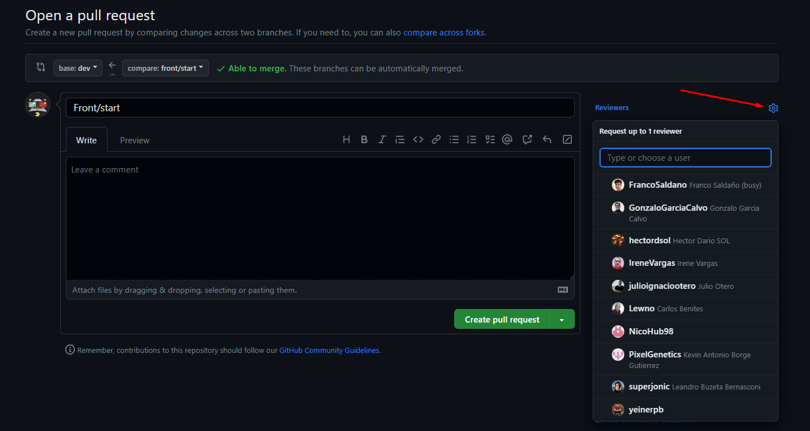

# s10-18-n-python-react
Aplicativo de administración de pacientes para el staff médico, donde se pueda manejar documentos, información de citas sobre pacientes y más...

Para arrancar el server de Frontend o Backend, esto estará en las carpetas con un `README.md` donde se explicara el proceso para instalar las dependencias y librerias para poder arrancar el proyecto y funcione correctamente.

Este archivo `README.md` estará especifico para como trabajar con Git y como las personas nuevas sin muchas experiencia, puedan desenvolverse con más facilidad con la documentación siguiente.

# Trabajo en equipo con Gitflow, 🤔 ¿Qué es un estrategia en git?
Es la manera en la que se administran los branches y releases, en otras palabras como se integra y se hace que el código de desarrollo llegue al branch de producción.


No voy a profundizar mucho, pero les voy a contar que la primera vez que vi esta imagen me costó entenderla, seguir el flujo, lineas, y flechas de como el código se mueve de un lugar a otro, se me hizo confuso, pero después de mucho tiempo de utilizarla, les puedo comentar algunos pros y cons que nos da:

- 👍 Pros:
    1. Alienta el uso de pull request.
    2. Control estricto de los cambios, porque normalmente solo algunos desarrolladores esta autorizados para aprobar los pull request.
    3. Después de entender como funciona, es simple de utilizar.
- 👎 Contras:
    1. Los primeros 2 beneficios también se convierten en contras, porque el tener tanto control del proceso alienta y crea dependencia de una persona o varias personas encargadas al momento revisar los cambios, en algunos casos puede llegar a convertirse en micro-management.
    2. El crear branches de larga vida (long-living branches), puede provocar que cuando necesitemos unificar (mergear) el código se creen muchos conflictos sobre todo en equipos que están desarrollando una misma sección. Ej. Supongamos que se va a crear el branch de release para que se le empiecen a realizar pruebas, por otra parte, el equipo debe seguir desarrollando funcionalidades que no son parte del release y se continua integrando código al branch de develop, creando así 2 lineas de "tiempo" (develop y release).
        
        
        *Release se convirtio en un branch de larga vida porque se le esta dando mantenimiento (agregando commits al branch)*
        
    3. No permite hacer un release de código rápido. Imaginemos que por error, reparamos un bug en el branch equivocado o se se integro al brach equivocado (siguiendo el flujo normal) vamos a tener que volver a crear un pull request, esperar al review, el build, correr los tests, etc., tiempo tiempo tiempo ⏳. O bien simplemente si queremos agarrar lo que se ha desarrollado y hacer un release inmediatamente, no es posible, es muy probable que el código no se encuentre listo para hacerlo.


## ¿Cómo será el flujo de trabajo y el orden que llevaremos?
### Conceptos clave
1. Branches (ramas):
   - `master` o `main`: Representa la rama principal del proyecto y contiene el código estable y probado. Las versiones de producción se basan en esta rama.
   - `develop`: Rama de desarrollo donde se integran todas las características completadas y probadas. Es una versión en constante evolución del proyecto.
   - `feature/`: Ramas para desarrollar nuevas características. Se ramifican desde develop y se fusionan nuevamente en `develop` cuando están listas.
   - `release/`: Ramas para preparar una nueva versión para su lanzamiento. Se ramifican desde develop, se realizan pruebas finales y se fusionan en `master` y `develop`.
   - `hotfix/`: Ramas para corregir problemas críticos en producción. Se ramifican desde `main`, se corrige el problema y se fusionan en `main` y `develop`.

2. Flujo de trabajo:
   - Nuevas características se desarrollan en ramas `feature/`.
   - Cuando una característica está lista, se fusiona en `develop`.
   - Para lanzar una nueva versión, se crea una rama `release/` desde develop, se realizan pruebas finales y se fusiona en `main` y develop.
   - Las correcciones críticas se abordan en ramas `hotfix/` que se basan en main.

### Comandos básicos de Gitflow

1. Inicialiar el repositorio o clonarlo:
   ```sh
   git clone https://github.com/No-Country/s10-18-n-python-react.git
   ```
2. Crear una nueva rama de característica:
   ```sh
   git checkout develop
   git pull origin develop
   git checkout -b feature/nombre-caracteristica
   ```
3. Desarrollar y hacer commit de la característica:
   En este punto seguiremos lo que se llama conventional commits, por favor checar esto [Conventional Commits](https://dev.to/achamorro_dev/conventional-commits-que-es-y-por-que-deberias-empezar-a-utilizarlo-23an) para entender más
   ```sh
   git add .
   git commit -m "Mensaje descriptivo"
   
   # Ejemplo
   git commit -am "feat(login): Se agregó formulario del login y del registro."
   ```
4. Crear Pull request cuando se finaliza de codear la característica en la cual se trabajó:
   ```sh
   git checkout nombre-rama-de-la-caracteristica
   git pull origin dev 
   git merge dev

   # Si la rama no esta creada o no aparece en Github, debemos poner el parametro "-u", de lo contrario, no agregarlo. 
   git push -u origin nombre-rama-de-la-caracteristica
   # Ejemplo:
   git push -u origin front/feature/login
   ```

Siempre evitaremos los conflictos de merging, pero, ¿Qué es un conflicto de merging?
Los conflictos de fusión (merging) pueden ocurrir cuando dos ramas diferentes tienen cambios en las mismas líneas de código. Sin embargo, existen prácticas y enfoques que puedes seguir para minimizar y evitar conflictos durante el proceso de fusión en Git. Aquí hay algunas sugerencias:


## Evitar Conflictos en Fusiones (Merging) en Git

Los conflictos de fusión (merging) pueden ocurrir cuando dos ramas diferentes tienen cambios en las mismas líneas de código. Sin embargo, existen prácticas y enfoques que puedes seguir para minimizar y evitar conflictos durante el proceso de fusión en Git. Aquí tienes algunas sugerencias:

### 1. Mantén tus ramas actualizadas:

Antes de realizar una fusión, asegúrate de que tanto la rama de destino como la rama que estás fusionando estén actualizadas. Esto reducirá la posibilidad de conflictos causados por diferencias en el código base.

```sh
git checkout develop
git pull origin develop

git checkout feature/nombre-caracteristica
git pull origin feature/nombre-caracteristica
```

### 2. Divide las características en trozos pequeños:

En lugar de trabajar en una característica extensa en una sola rama, divide el trabajo en cambios más pequeños y trabaja en ellos en ramas separadas. Esto reduce la probabilidad de que dos desarrolladores trabajen en las mismas líneas de código.

### 3. Comunica y coordina:

Asegúrate de que tu equipo esté al tanto de las áreas en las que estás trabajando. La comunicación puede ayudar a evitar que varios desarrolladores trabajen en las mismas partes del código simultáneamente.

### 4. Utiliza rebase en lugar de merge:

En lugar de fusionar ramas directamente, considera usar rebase. El rebase reescribe la historia de la rama en la que estás trabajando, lo que puede resultar en una línea de tiempo más limpia y reducir la posibilidad de conflictos. Sin embargo, debes usarlo con precaución, especialmente en ramas compartidas.

```sh
git checkout feature/nombre-caracteristica
git rebase develop
```

### 5. Realiza pruebas frecuentes:

A medida que trabajas en tu rama, realiza pruebas frecuentes para asegurarte de que todo funcione correctamente. Esto permite detectar y resolver problemas temprano, antes de realizar la fusión.

### 6. Utiliza herramientas visuales:

Herramientas visuales como GitKraken, Sourcetree, Git Graph u otras interfaces gráficas pueden ayudarte a visualizar las diferencias entre las ramas antes de realizar la fusión, lo que puede reducir la probabilidad de errores.



### 7. Resuelve conflictos localmente:

Siempre que sea posible, resuelve los conflictos de fusión localmente en tu entorno de desarrollo antes de hacer una solicitud de fusión (pull request) o integrar tus cambios. Esto te permite comprender y controlar mejor el proceso de resolución.

### 8. Mantén la calma y la colaboración:

Los conflictos son inevitables en un entorno de desarrollo colaborativo. Mantén una actitud positiva y colaborativa cuando surjan conflictos. La comunicación y el trabajo en equipo son fundamentales para resolverlos de manera eficaz.

Siguiendo estas prácticas, puedes minimizar la posibilidad de conflictos al fusionar ramas en Git y mantener un flujo de trabajo colaborativo y ordenado.

# Conclusión

Nosotros solo daremos uso de las ramas `features` y `fix`, haremos lo basico de creación de estas ramas, donde haremos los pull requests hacia la rama `dev` en GitHub, crear un pull request es simplemente crear la rama en la cual vamos a trabajar la característica, ya sea un fix o una feature de algo, cuando creamos la rama en local y hacemos commits de nuestro código en esa rama, simplemente hacemos `git push -u origin nombre-de-la-rama`, esto siguiendo la convención que se ha dicho, entre mejores nombres a las ramas y commits, menos confusiones y mejor entendimiento de lo que se hace. Después de hacer el push, vamos al repositorio de GitHub y se van a las ramas, lo pueden hacer dando [click acá](https://github.com/No-Country/s10-18-n-python-react/branches), y les apecerá lo siguiente: 



Ahí les aparece todas las ramas y simplemente buscan la rama que le hicieron push al repositorio, y le dan en `New pull request`



Si se fijan, debemos con que rama queremos llevar los cambios, seleccionamos `dev` y la rama que subieron en la parte de `compare:`. Para finaliar, dejar un comentario de lo que hicieron en esa rama, corto y preciso, y luego completan seleccionando el `reviewers`, `assigness` (acá se asignarán ustedes mismos), `labels` (acá pondran que caracteristica trabajaron, ejemplo: feature, fix, docs, tests, etc...), y listo.

